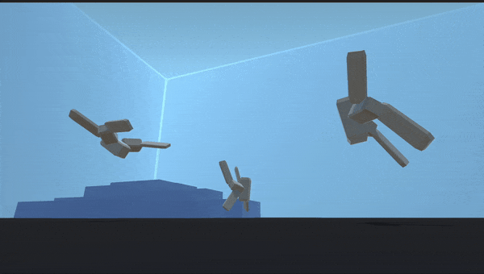

# The Simsulator

The Simsulator is an open-source platform for evolving, breeding and experimenting on virtual creatures, based on the work of [Karl Sims](https://karlsims.com).

## Features

- Evolve virtual creatures to run, swim and follow lights in the Evolution Simulator.
- Play with and selectively breed creatures in the Zoo.
- Tweak the DNA of existing creatures in the Creature Editor.
- Save your favourite creatures and share them with your friends.

## Installation

1. Download the latest release [here](https://github.com/mycoolfin/the-simsulator/releases/latest).
2. Unzip the file and run the executable.

## Build

1. Clone this repository to your local machine using `git clone https://github.com/mycoolfin/The-Simsulator.git`
2. Install [Unity](https://store.unity.com/download).
3. Open the project in Unity.
4. Follow the instructions in the [Unity Manual](https://docs.unity3d.com/Manual/PlatformSpecific.html) to build the project for your target operating system.

## License

This project is licensed under the [MIT License](LICENSE).
